# TruDelta System Documentation


## Table of Contents
1. [Introduction](#introduction)
   - [System Overview](#system-overview)
   - [Component Architecture](#component-architecture)
     - [Core Components](#core-components)
     - [External Dependencies](#external-dependencies)
   - [Key Interfaces](#key-interfaces)
     - [Motion Control Interface](#motion-control-interface)
     - [Part Editing Interface](#part-editing-interface)
     - [Safety System Interface](#safety-system-interface)
   - [Integration Points](#integration-points)
     - [External System Integration](#external-system-integration)
     - [Configuration Management](#configuration-management)

2. [Development Guide](#development-guide)
   - [Development Environment Setup](#development-environment-setup)
     - [Prerequisites](#prerequisites)
     - [Required Dependencies](#required-dependencies)
     - [Development Machine Setup](#development-machine-setup)
   - [Code Organization and Standards](#code-organization-and-standards)
     - [Naming Conventions](#naming-conventions)
     - [File Organization](#file-organization)
     - [Code Style Guidelines](#code-style-guidelines)
   - [Testing and Validation](#testing-and-validation)
     - [Unit Tests](#unit-tests)
     - [Integration Tests](#integration-tests)
     - [Simulation Testing](#simulation-testing)
   - [Debugging and Diagnostics](#debugging-and-diagnostics)
     - [Logging System](#logging-system)
     - [Debug Tools](#debug-tools)
     - [Common Debug Scenarios](#common-debug-scenarios)
   - [Extension Guidelines](#extension-guidelines)
     - [Adding New Features](#adding-new-features)
     - [Modifying Existing Code](#modifying-existing-code)
     - [Safety Considerations](#safety-considerations)
   - [Performance Considerations](#performance-considerations)
     - [Optimization Guidelines](#optimization-guidelines)
     - [Resource Management](#resource-management)
     - [Scalability](#scalability)
   - [Best Practices](#best-practices)
     - [Code Maintenance](#code-maintenance)
     - [Documentation](#documentation)
     - [Collaboration](#collaboration)
   - [Common Pitfalls](#common-pitfalls)
     - [Development Issues](#development-issues)
     - [Maintenance Issues](#maintenance-issues)
     - [Extension Issues](#extension-issues)

3. [System Architecture](#system-architecture)
   - [Additional System Diagrams](#additional-system-diagrams)
     - [Class Hierarchy Overview](#class-hierarchy-overview)
     - [System State Management](#system-state-management)
     - [Configuration Management Flow](#configuration-management-flow)
     - [Motion Control Sequence](#motion-control-sequence)
     - [Safety System State Machine](#safety-system-state-machine)
     - [System Component Dependencies](#system-component-dependencies)
     - [Data Flow Architecture](#data-flow-architecture)
   - [Enhanced System Diagrams](#enhanced-system-diagrams)
     - [Detailed Class Hierarchy](#detailed-class-hierarchy)
     - [Enhanced Motion Control Sequence](#enhanced-motion-control-sequence)
     - [Part Program Execution Flow](#part-program-execution-flow)
     - [Safety System Integration](#safety-system-integration)
     - [Configuration Management](#configuration-management)
     - [Enhanced System Component Dependencies](#enhanced-system-component-dependencies)
     - [Data Flow Architecture](#data-flow-architecture)
     - [System Initialization Flow](#system-initialization-flow)

4. [Operations](#operations)
   - [Build and Deployment](#build-and-deployment)
   - [Version Control](#version-control)
   - [Update Procedures](#update-procedures)
   - [Rollback Procedures](#rollback-procedures)

5. [Troubleshooting](#troubleshooting)
   - [Troubleshooting Guide](#troubleshooting-guide)
     - [Common Issues and Solutions](#common-issues-and-solutions)
   - [Diagnostic Tools](#diagnostic-tools)
   - [Recovery Procedures](#recovery-procedures)

6. [Support](#support)
   - [Support Infrastructure](#support-infrastructure)
   - [Resources](#resources)
     - [Documentation](#documentation)
     - [Tools](#tools)
   - [Team Contacts](#team-contacts)

## Introduction

### System Overview
TruDelta is a sophisticated machine control and automation system designed for precision manufacturing and motion control applications. The system integrates various components including motion control, part editing, diagnostics, and safety features.

#### What is Tru Delta?
Tru Delta is a CNC programming application designed to create, edit, and execute part programs for precision machining. It provides an intuitive user interface that allows machinists, engineers, and operators to define tool paths, set machining parameters, and generate G-code instructions tailored to specific CNC machines.

The software supports two primary types of programs:
* **Standard Programs** – Used for general machining operations.  
* **Dress Programs** – Used for wheel dressing operations to maintain optimal tool conditions.

Tru Delta streamlines CNC programming by offering drag-and-drop motion sequencing, real-time simulation, and direct communication with supported machine controllers. It also provides features for exporting and importing programs, making it easier to share and manage machining workflows.


#### Software Specifications
Tru Delta is built on the **.NET framework** using **C#** as the primary programming language. The application follows a modular architecture, enabling easy expansion and maintenance.

**System Requirements**
* **Operating System**: Windows 10 or later  
* **Processor**: Intel Core i5 or higher  
* **RAM**: 8GB minimum (16GB recommended for larger projects)  
* **Storage**: 500MB of free disk space  
* **Additional Software**:  
  * Visual Studio 2017 (for development)  
  * Microsoft .NET Framework 4.8  
  * Tru Delta Machine Configuration Files

**Key Dependencies & Technologies**
* **Motion Controller Support**: Compatible with Mitsubishi-based controllers and offline simulation mode.  
* **File Handling**: Uses **XML-based** storage for part files and program configurations.  
* **UI Framework**: Windows Forms (WinForms) for graphical user interface components.  
* **Error Logging**: Integrated logging system using `DiagnosticManager`.

#### G-Code Support
G-code (Geometric Code) is the programming language used to control CNC machines. Tru Delta generates G-code based on user-defined part programs, translating motion sequences into precise machine commands.

**Common G-Code Commands Used in Tru Delta**

| Code | Description |
| :---- | :---- |
| G00 | Rapid positioning |
| G01 | Linear interpolation (cutting motion) |
| G02 | Circular interpolation (clockwise) |
| G03 | Circular interpolation (counterclockwise) |
| G17/G18/G19 | Plane selection (XY, ZX, YZ) |
| G20/G21 | Unit selection (Inches/Millimeters) |
| G28 | Return to home position |
| G41/G42 | Cutter compensation (left/right) |

**Tru Delta's Role in G-Code Generation**
* The software allows users to **visually construct** CNC toolpaths instead of manually writing G-code.  
* Programs are compiled into machine-readable G-code and sent to the CNC controller.  
* Users can review and modify G-code before execution.

#### Key Features
**Core Features**
* **Program Creation & Editing** – Easily define machining sequences with an intuitive UI.  
* **G-Code Generation** – Automatically generates industry-standard G-code for CNC machines.  
* **Simulation & Verification** – Preview tool motions before execution to reduce errors.  
* **Machine Communication** – Send and receive programs directly from compatible CNC controllers.  
* **Customization & Configuration** – Supports different machine types and allows user-defined settings.  
* **Import/Export Capabilities** – Enables sharing programs between systems.  
* **Error Handling & Logging** – Tracks issues and provides troubleshooting insights.

#### Target Audience
**Who Should Use Tru Delta?**
* **CNC Machinists & Operators** – For running and modifying programs on supported machines.  
* **Manufacturing Engineers** – To develop and optimize machining processes.  
* **Software Developers & Integrators** – For extending or integrating Tru Delta into larger systems.

#### Supported CNC Machines
**Compatible Machines & Controllers**
* **Mitsubishi-based Controllers** (e.g., M700/M800 Series)  
* **Tru Tech Systems CNC Machines** (T93X, TT820, T23X, R22X, AD220)  
* **Offline Mode** – For testing programs without a physical machine.

#### Software Limitations
* **Limited to Supported Controllers** – May not work with non-Mitsubishi controllers without modifications.  
* **Windows-Only** – Not available for macOS or Linux.  
* **No Built-in 3D Simulation** – Provides motion sequence visualization but not full 3D rendering.

### Component Architecture

#### Core Components
1. **TruDeltaClasses**
   - Foundation: Core system infrastructure and base classes
   - MotionController: Handles all motion control operations
   - PartEditing: Manages part program editing and manipulation
   - Diagnostics: System health monitoring and troubleshooting
   - HomingAndOffsets: Machine calibration and position management
   - HelperClasses: Utility classes and common functionality
   - NativeMethods: Low-level system integration
   - Vendor Provided: Third-party integrations

2. **TruDeltaForms**
   - User interface components and forms

3. **TruDelta Infrastructure**
   - System-level services and infrastructure components

4. **UserControls**
   - Reusable UI components

5. **TruSim**
   - Simulation components for testing and validation

#### External Dependencies
- **Motion Controller Libs**: Hardware-specific motion control libraries
- **DLLs**: Required system libraries and dependencies
- **ncapi32.dll**: Native API for machine control

### Key Interfaces

#### Motion Control Interface
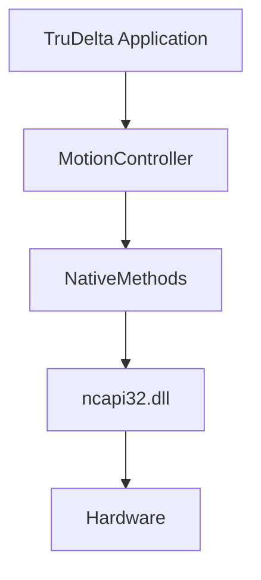
*This diagram shows the motion control interface hierarchy. The TruDelta Application communicates with the MotionController, which uses NativeMethods to interface with the ncapi32.dll. This DLL provides the low-level hardware communication layer. This layered architecture allows for hardware abstraction and easier maintenance.*

**Related Diagrams:**
- See [Enhanced Motion Control Sequence](#enhanced-motion-control-sequence) for detailed flow
- See [System Component Dependencies](#enhanced-system-component-dependencies) for integration points

**Code Example:**
```csharp
// Example of motion control initialization
public class MotionController : IMotionControlInterface
{
    private NativeMethods nativeMethods;
    
    public void Initialize()
    {
        nativeMethods = new NativeMethods();
        if (!nativeMethods.ConnectToHardware())
        {
            throw new HardwareConnectionException("Failed to connect to motion controller");
        }
    }
    
    public void MoveToPosition(double x, double y, double z)
    {
        if (!CncConnected)
            throw new InvalidOperationException("Controller not connected");
            
        nativeMethods.SendMoveCommand(x, y, z);
    }
}
```

**Troubleshooting:**
- If motion commands fail, check:
  1. Hardware connection status (CncConnected property)
  2. Safety system status (ControllerInEStop property)
  3. Native method return codes
  4. Hardware error logs
- Common issues:
  - Connection timeouts: Verify network/communication settings
  - Command failures: Check safety interlocks
  - Position errors: Verify axis calibration

#### Part Editing Interface
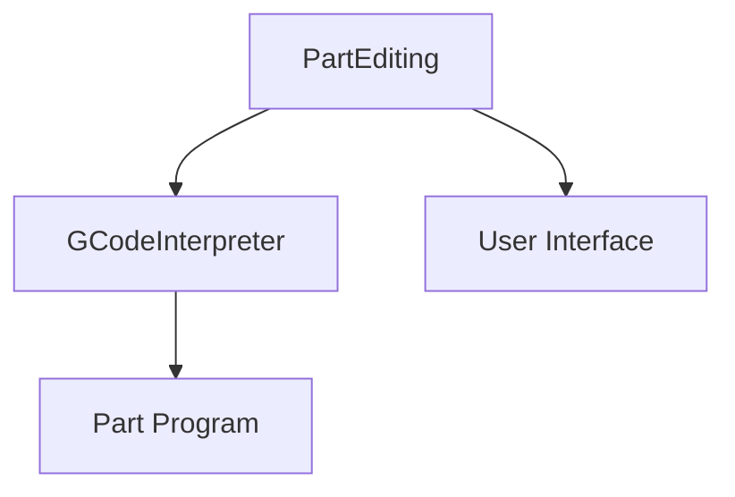
*The Part Editing Interface demonstrates how part programs are managed. The PartEditing component uses a GCodeInterpreter to process part programs, while also maintaining a direct connection to the User Interface for real-time editing and feedback.*

**Related Diagrams:**
- See [Part Program Execution Flow](#part-program-execution-flow) for state transitions
- See [Data Flow Architecture](#data-flow-architecture) for information flow

**Code Example:**
```csharp
// Example of part program editing
public class PartEditor
{
    private GCodeInterpreter interpreter;
    private PartFile currentPart;
    
    public void LoadProgram(string filePath)
    {
        currentPart = new PartFile();
        currentPart.LoadFromFile(filePath);
        
        // Validate program
        if (!interpreter.ValidateProgram(currentPart.Moves))
        {
            throw new InvalidProgramException("Program validation failed");
        }
    }
    
    public void AddMove(Move move)
    {
        if (currentPart.ValidateMove(move))
        {
            currentPart.AddMove(move);
            UpdateUserInterface();
        }
    }
}
```

**Troubleshooting:**
- If program editing fails, check:
  1. File permissions and paths
  2. GCode syntax validation
  3. Move parameter validation
  4. UI update handlers
- Common issues:
  - Invalid GCode: Check syntax and parameters
  - File access: Verify permissions and paths
  - UI updates: Check event handlers

#### Safety System Interface
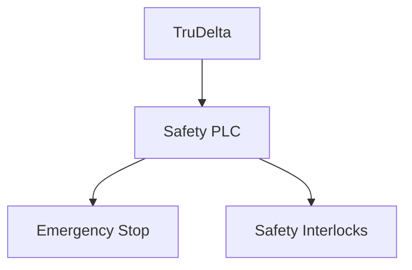
*The Safety System Interface shows the critical safety architecture. TruDelta communicates with a dedicated Safety PLC that manages both the Emergency Stop system and various Safety Interlocks. This separation ensures that safety functions remain independent of the main control system.*

**Related Diagrams:**
- See [Safety System Integration](#safety-system-integration) for detailed safety paths
- See [System Initialization Flow](#system-initialization-flow) for startup sequence

**Code Example:**
```csharp
// Example of safety system integration
public class SafetySystem
{
    private SafetyPLC safetyPLC;
    
    public bool CheckSafetyStatus()
    {
        if (safetyPLC.IsEmergencyStopActive())
            return false;
            
        if (!safetyPLC.VerifyInterlocks())
            return false;
            
        return true;
    }
    
    public void HandleSafetyViolation()
    {
        safetyPLC.ActivateEmergencyStop();
        LogSafetyEvent("Safety violation detected");
        NotifyOperators();
    }
}
```

**Troubleshooting:**
- If safety system issues occur, check:
  1. Emergency stop circuit continuity
  2. Interlock sensor status
  3. PLC communication status
  4. Safety event logs
- Common issues:
  - False triggers: Check sensor calibration
  - Communication loss: Verify PLC connection
  - Interlock failures: Inspect physical switches

### Integration Points

#### External System Integration
1. **Autoloader Simulator**
   - Integration for automated part loading/unloading
   - Interface through standard communication protocols

2. **Machine Control Panel**
   - Physical control interface
   - Emergency stop and safety features

3. **MitsuWatchWindow**
   - Monitoring and diagnostics interface
   - Real-time system status display

#### Configuration Management
- **TDAppSettings.xml**: Application configuration
- **TDX.xml**: System configuration
- **Strings.xml**: Localization and string resources

## Development Guide

### Development Environment Setup

#### Operating Environment
Tru Delta is designed for Windows-based environments and requires specific software and hardware to run efficiently.

**Minimum System Requirements**
* **Operating System**: Windows 10 or later (64-bit)  
* **Processor**: Intel Core i5 or higher  
* **RAM**: 8GB (16GB recommended for larger programs)  
* **Storage**: 500MB of free disk space  
* **Display**: 1280x720 resolution or higher  
* **Additional Software**:  
  * **Visual Studio 2017** (Required for development)  
  * **.NET Framework 4.8**  
  * **Tru Delta Machine Configuration Files**


#### Local Development Setup
To set up a development environment for Tru Delta, follow these steps:

1. **Prepare Your Machine**  
   * Ensure you are using a Windows computer that meets the system requirements.  
   * Install **Visual Studio 2017** if not already installed.  
2. **Install Tru Delta and Dependencies**  
   * Locate the **T93XM Installer (version 8.28.19)** folder.  
   * Run **Tru Delta Install 10.2.6.0.exe** to install the software.  
     * If installation is blocked, temporarily disable **Chrome Safe Browsing** and **Windows Security**.  
3. **Configure the Machine**  
   * Set up the machine as **T93X and Offline Station**.  
   * Restart the machine after completing the setup.  
4. **Clone the Tru Delta Repository**  
   * Open **Git** or **GitHub Desktop** and clone the Tru Delta repository to your local machine.  
5. **Configure Project Settings**  
   * Open the **Tru Delta solution file (.sln)** in Visual Studio.  
   * Navigate to `TruDelta/TDAppSettings.xml` and update:  
     * `MotionControllerID` → **MITSU** → `OFFLINE`  
     * `MachineType` → `T93X`  
     * `FolderTruDeltaProgramRoot` → `TruDelta/Tru-Delta-X/TruDelta/bin/Debug - Offline`  
6. **Copy Required Files**  
   * Navigate to the **Tru Tech Systems** folder in `C:\Program Files (x86)\Tru Tech Systems\Tru Delta X\Execute`.  
   * Copy its contents to `TruDelta/Tru-Delta-X/TruDelta/bin/Debug - Offline`.  
   * Copy all other folders from `C:\Program Files (x86)\Tru Tech Systems\Tru Delta X` to `TruDelta/Tru-Delta-X/TruDelta/bin/Debug - Offline`.  
7. **Set Up Visual Studio**  
   * In the **top bar** of Visual Studio:  
     * Set **Startup Project** to `TruDelta`.  
     * Set **Solution Platform** to `x86`.  
     * Set **Solution Configuration** to `Debug`.  
   * Click the **Start** button to launch Tru Delta in development mode.


### Code Organization and Standards

#### Naming Conventions
- Classes: PascalCase (e.g., `MotionController`)
- Methods: PascalCase (e.g., `InitializeMotion`)
- Properties: PascalCase (e.g., `CncConnected`)
- Private fields: camelCase with underscore prefix (e.g., `_motionStatus`)
- Constants: UPPER_CASE (e.g., `MAX_AXIS_SPEED`)

#### File Organization
- Keep related classes in the same directory
- Follow existing directory structure
- Maintain separation of concerns
- Group interfaces with implementations

#### Code Style Guidelines
- Use XML documentation for public members
- Follow existing error handling patterns
- Maintain consistent indentation
- Use meaningful variable names
- Add comments for complex logic

### Testing and Validation

#### Unit Tests
- Test motion control operations
- Validate part program processing
- Verify safety system responses
- Check configuration management
- Test error handling

#### Integration Tests
- Verify hardware communication
- Test safety system integration
- Validate part program execution
- Check system initialization
- Test error recovery

#### Simulation Testing
- Use TruSim for motion testing
- Validate safety scenarios
- Test part program execution
- Verify error handling
- Check system recovery

### Debugging and Diagnostics

#### Logging System
- Use built-in diagnostic tools
- Check MitsuWatchWindow
- Monitor safety system logs
- Review motion controller logs
- Check XML configuration logs

#### Debug Tools
- Mitsubishi CNC debug tools
- Safety PLC monitoring
- GCode interpreter debugger
- XML configuration validator
- System state monitor

#### Common Debug Scenarios
1. Motion Control Issues
   - Check connection status
   - Verify safety system
   - Monitor axis movement
   - Check error codes

2. Part Program Issues
   - Validate GCode syntax
   - Check move parameters
   - Verify program flow
   - Monitor execution

3. Safety System Issues
   - Check sensor status
   - Verify PLC communication
   - Monitor interlock status
   - Check emergency stop

### Extension Guidelines

#### Adding New Features
1. Identify integration points
2. Follow existing patterns
3. Maintain safety requirements
4. Add appropriate tests
5. Update documentation

#### Modifying Existing Code
1. Understand current implementation
2. Maintain backward compatibility
3. Update affected tests
4. Document changes
5. Verify safety implications

#### Safety Considerations
1. Never bypass safety checks
2. Maintain safety system integrity
3. Follow established protocols
4. Document safety changes
5. Verify with safety team

### Performance Considerations

#### Optimization Guidelines
- Minimize hardware communication
- Cache frequently used data
- Optimize XML processing
- Reduce UI updates
- Manage memory efficiently

#### Resource Management
- Properly dispose of resources
- Manage hardware connections
- Handle memory efficiently
- Monitor system resources
- Clean up temporary files

#### Scalability
- Consider future expansion
- Design for multiple axes
- Support additional features
- Plan for increased load
- Maintain flexibility

### Best Practices

#### Code Maintenance
- Regular code reviews
- Update documentation
- Maintain test coverage
- Follow coding standards
- Address technical debt

#### Documentation
- Keep documentation current
- Document all changes
- Maintain API documentation
- Update troubleshooting guides
- Record known issues

#### Collaboration
- Use version control
- Follow coding standards
- Document changes
- Review code changes
- Share knowledge

### Common Pitfalls

#### Development Issues
1. Ignoring safety requirements
2. Bypassing validation
3. Poor error handling
4. Insufficient testing
5. Incomplete documentation

#### Maintenance Issues
1. Not following standards
2. Ignoring warnings
3. Poor code organization
4. Insufficient comments
5. Outdated documentation

#### Extension Issues
1. Breaking compatibility
2. Ignoring patterns
3. Poor integration
4. Insufficient testing
5. Missing documentation

## System Architecture

### Additional System Diagrams

#### Class Hierarchy Overview
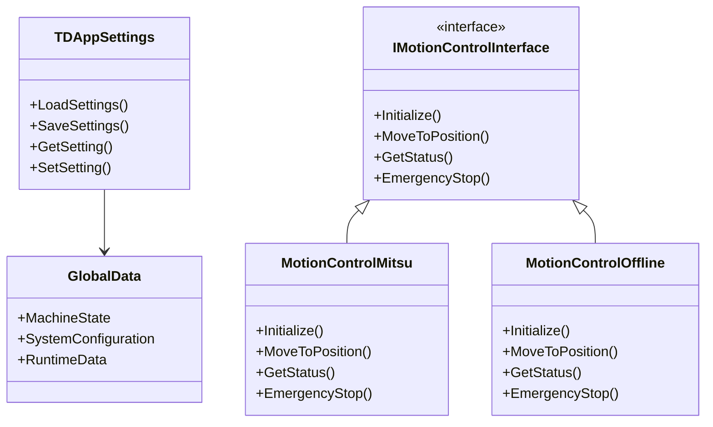

#### System State Management
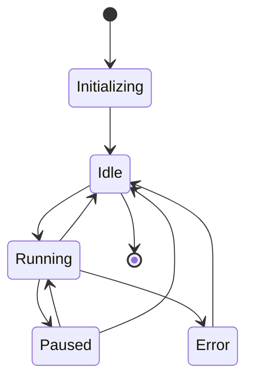

#### Configuration Management Flow
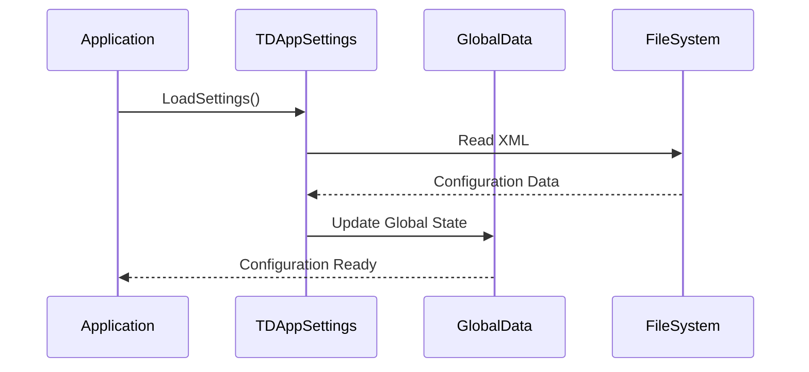

#### Motion Control Sequence
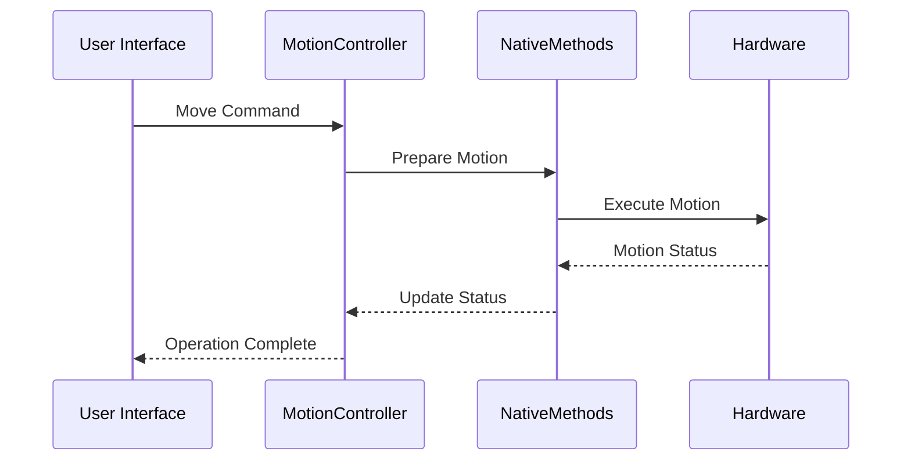

#### Safety System State Machine
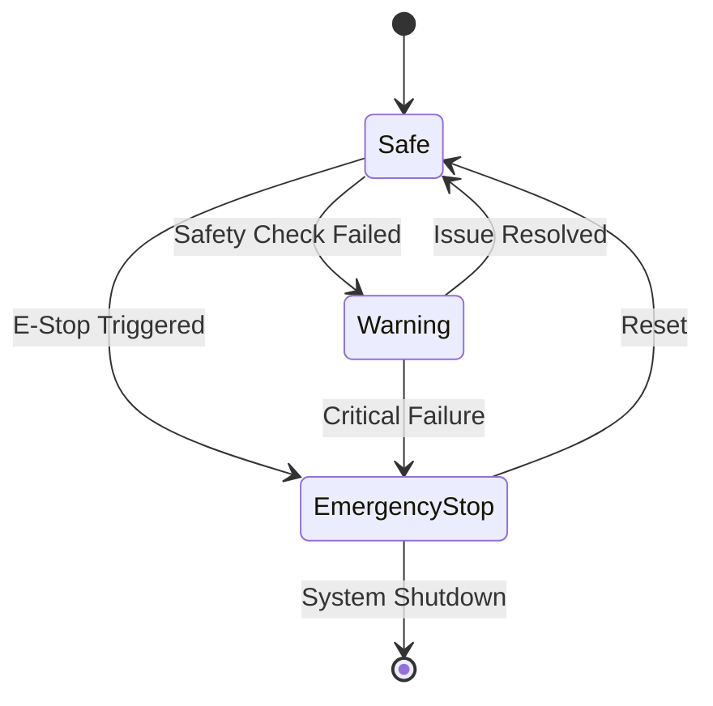

#### System Component Dependencies
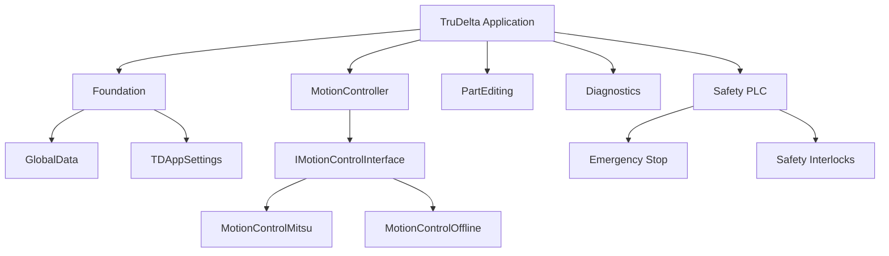

#### Data Flow Architecture
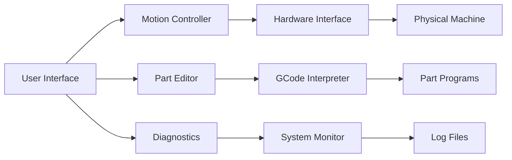

### Enhanced System Diagrams

#### Detailed Class Hierarchy
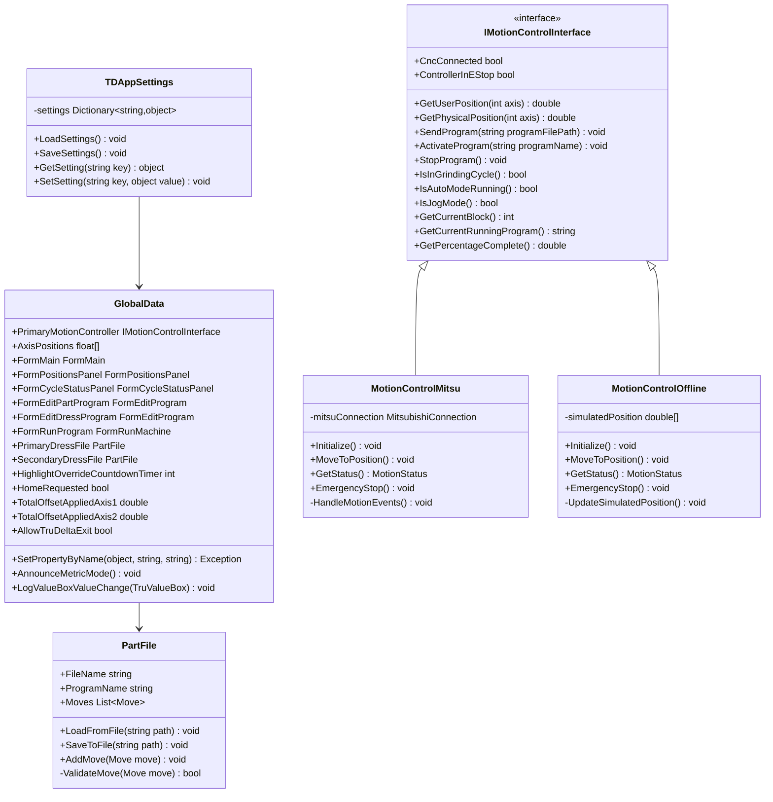
*This detailed class hierarchy shows the core classes and their relationships in the TruDelta system. Key points:*
- *TDAppSettings manages application configuration with methods for loading and saving settings*
- *GlobalData serves as a central repository for system state and UI components*
- *IMotionControlInterface defines the contract for motion control implementations*
- *MotionControlMitsu and MotionControlOffline provide concrete implementations for different scenarios*
- *PartFile manages part program data and validation*

**Related Diagrams:**
- See [System Component Dependencies](#enhanced-system-component-dependencies) for integration context
- See [Configuration Management](#configuration-management) for settings flow

**Code Example:**
```csharp
// Example of configuration management
public class TDAppSettings
{
    private Dictionary<string, object> settings;
    
    public void LoadSettings()
    {
        settings = LoadFromXML("TDAppSettings.xml");
        ValidateSettings();
        UpdateGlobalState();
    }
    
    private void UpdateGlobalState()
    {
        GlobalData.MachineState = (MachineState)settings["MachineState"];
        GlobalData.SystemConfiguration = (SystemConfig)settings["SystemConfig"];
    }
}
```

**Troubleshooting:**
- If configuration issues occur, check:
  1. XML file format and schema
  2. Setting validation rules
  3. Global state updates
  4. Configuration backup files
- Common issues:
  - Invalid settings: Check XML validation
  - State corruption: Verify backup restoration
  - Update failures: Check event handlers

#### Enhanced Motion Control Sequence
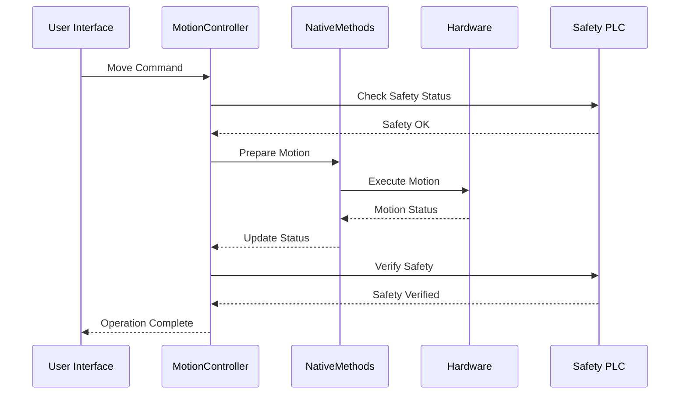
*This sequence diagram illustrates the complete motion control process with safety integration:*
1. *User interface initiates motion commands*
2. *Safety system is checked before motion begins*
3. *Native methods prepare and execute the motion*
4. *Hardware status is monitored and reported*
5. *Safety is verified after motion completion*
6. *Operation status is returned to the user interface*

#### Part Program Execution Flow
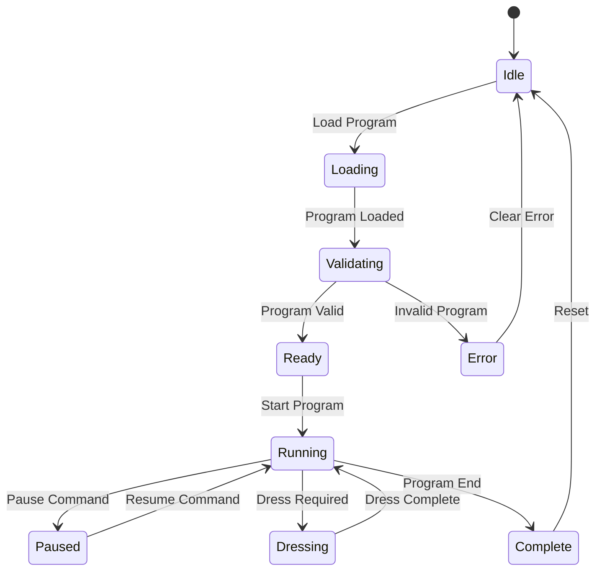
*The Part Program Execution Flow shows the lifecycle of a part program:*
- *Programs start in Idle state and progress through loading and validation*
- *Running state can transition to Paused or Dressing states*
- *Dressing operations are handled as a distinct state*
- *Error handling provides recovery paths*
- *Completion returns the system to Idle state*

#### Safety System Integration
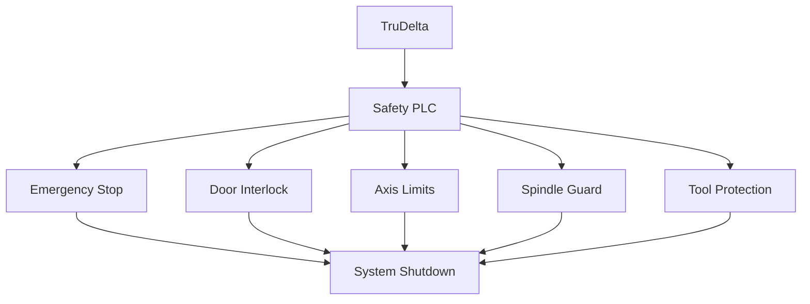
*The Safety System Integration diagram shows the comprehensive safety architecture:*
- *Safety PLC centralizes all safety functions*
- *Multiple safety mechanisms (Emergency Stop, Door Interlock, etc.)*
- *All safety violations lead to System Shutdown*
- *Independent safety paths ensure redundancy*

#### Configuration Management
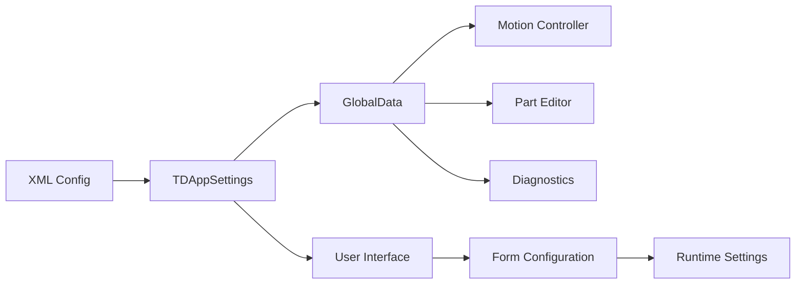
*Configuration Management flow shows how settings are distributed:*
- *XML configuration files serve as the source of truth*
- *TDAppSettings manages configuration loading and saving*
- *GlobalData distributes settings to system components*
- *User Interface maintains runtime configuration state*

#### Enhanced System Component Dependencies
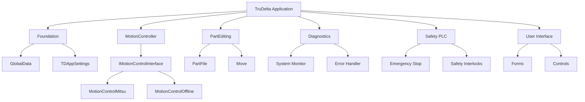
*This diagram shows the complete system architecture:*
- *Foundation layer provides core services*
- *MotionController handles hardware communication*
- *PartEditing manages program creation and editing*
- *Diagnostics provides system monitoring*
- *Safety PLC ensures system safety*
- *User Interface components handle user interaction*

#### Data Flow Architecture
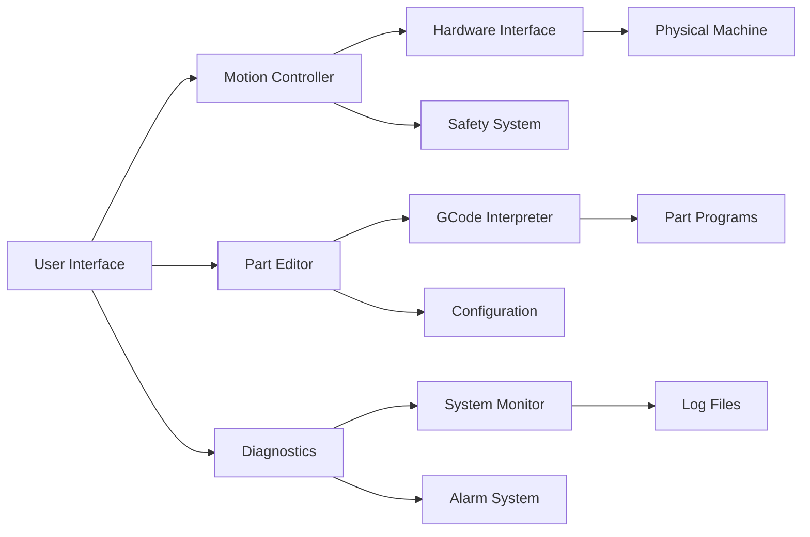
*The Data Flow Architecture shows how information moves through the system:*
- *User Interface serves as the primary interaction point*
- *Motion Controller manages hardware communication*
- *Part Editor processes GCode programs*
- *Diagnostics monitors system health*
- *Safety System ensures safe operation*
- *Configuration and Alarm systems provide system management*

#### System Initialization Flow
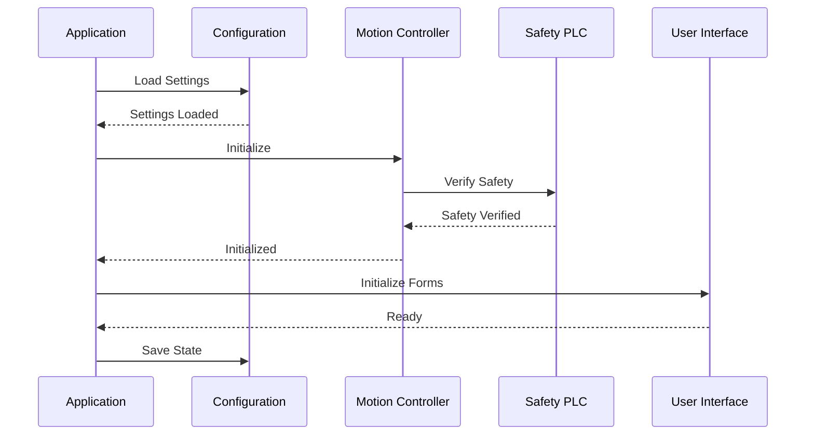
*The System Initialization Flow shows the startup sequence:*
1. *Application loads configuration settings*
2. *Motion Controller initializes and verifies safety*
3. *User Interface components are initialized*
4. *System state is saved for recovery*
5. *Each step requires successful completion before proceeding* 

## Operations

### Build and Deployment
- Use BuildUtilities for compilation
- Follow PostSolutionBuildProject procedures
- Use Installer for deployment

### Version Control
- Use provided .gitignore
- Follow established branching strategy
- Document significant changes 

### Update Procedures
1. Backup current installation
2. Verify new version
3. Update configuration
4. Test functionality
5. Document changes

### Rollback Procedures
1. Maintain backup copies
2. Document rollback steps
3. Verify system state
4. Test functionality
5. Update documentation

## Troubleshooting

### Troubleshooting Guide

#### Common Issues and Solutions

1. **Motion Control Issues**
   - *Symptom*: Motion commands fail
   - *Check*: 
     - Hardware connection status
     - Safety system status
     - Axis calibration
     - Error logs
   - *Solution*: See [Motion Control Interface](#motion-control-interface) troubleshooting

2. **Part Program Issues**
   - *Symptom*: Program validation fails
   - *Check*:
     - GCode syntax
     - Move parameters
     - File permissions
   - *Solution*: See [Part Editing Interface](#part-editing-interface) troubleshooting

3. **Safety System Issues**
   - *Symptom*: False safety triggers
   - *Check*:
     - Sensor calibration
     - PLC communication
     - Interlock status
   - *Solution*: See [Safety System Interface](#safety-system-interface) troubleshooting

4. **Configuration Issues**
   - *Symptom*: Settings not applied
   - *Check*:
     - XML validation
     - State updates
     - Backup files
   - *Solution*: See [Configuration Management](#configuration-management) troubleshooting

#### Diagnostic Tools
- Use MitsuWatchWindow for real-time monitoring
- Check system logs in Diagnostics directory
- Verify safety system status through Safety PLC interface
- Monitor motion controller status through native API

#### Recovery Procedures
1. **Emergency Stop**
   - Follow safety protocols
   - Check error logs
   - Verify system status
   - Reset safety system

2. **System Crash**
   - Restore from last known good configuration
   - Verify system state
   - Check error logs
   - Restart affected components

3. **Communication Loss**
   - Verify network connections
   - Check hardware status
   - Restart communication services
   - Verify data integrity

## Support

### Support Infrastructure
The following components are considered infrastructure/support and should be referenced but not modified:
- Autoloader Simulator
- BuildUtilities
- GCodeInterpreter
- Installer
- MachineControlPanel
- MitsuWatchWindow
- PostSolutionBuildProject
- Safety PLC

### Resources

#### Documentation
- Mitsubishi CNC API documentation
- Safety PLC documentation
- GCode reference manual
- XML schema documentation
- System architecture documents

#### Tools
- Visual Studio extensions
- Mitsubishi development tools
- Safety PLC tools
- XML editors
- Diagnostic tools

### Team Contacts
- Development team contacts
- Safety team contacts
- Hardware support
- Software support
- Documentation team

### Program Creation and Management

#### Creating Programs
5. **Set Parameters & Save**  
   * Click on a movement to modify its parameters in the **right panel**.  
   * Adjust global program settings using **Program Setup** in the left panel.  
   * Click **"Run Program"** to save changes.


#### Running Programs
4. **Stopping the Program**  
   * Click **Stop** in the bottom menu to halt execution.  
   * To return the CNC arm to its home position, press **Home**.


#### Editing Programs
**Option 3: Right-Click**  
1. Right-click on the program.  
2. Select **Edit** from the context menu.


#### Exporting and Importing Programs
**Option 2: Right-Click**  
1. Right-click the program.  
2. Select **Export** and choose a destination folder.


### System Architecture Overview
Tru Delta follows a modular architecture with clear separation of concerns and well-defined interfaces between components.


### Troubleshooting Guide

#### Application Crashes
If Tru Delta crashes on startup with the error "Tru Delta ended prematurely due to an exception":

1. Add break point to line 343 in file `TruDelta/TruDeltaClasses/Foundation/Program.cs`  
2. View error in `theError` parameter by hovering over the variable in debug mode


